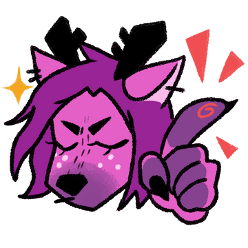

import { Card, CardGrid } from '@astrojs/starlight/components';

<CardGrid>
    <Card title="Alistu a.k.a. Menaceman44" icon="pencil">
        Alistu is a modder and custom content creator. He has shared knowledge and tutorials for the site.
        
        Find Alistu on [tumblr](https://alistu.tumblr.com/) or [ModTheSims](https://modthesims.info/member.php?u=59363) or [Patreon](https://www.patreon.com/c/menaceman44/)
    </Card>
    <Card title="Amethyst Lilac" icon="pencil">
        Amethyst Lilac is a modder and custom content creator, did the initial web design for the site, and has contributed a tutorial and reference material for the site.

        Find Amethyst Lilac on [Patreon](https://www.patreon.com/c/amethystlilac) or [tumblr](https://amethystamanda.tumblr.com/)
    </Card>
    <Card title="CodeBleu" icon="setting">
        CodeBleu is a modder and tool creator, did the initial website set up, and has contributed technical support for the site.
        Find CodeBleu on [Itch.io](https://codebleu.itch.io/)
    </Card>
    <Card title="FellowFur" icon="pencil">  
        FellowFur is a modder and custom content creator, and has shared a tutorial for this site.

        Find FellowFur on [Nexus](https://www.nexusmods.com/thesims4/users/42871565)
    </Card>
    <Card title="Fogity" icon="open-book">
        Fogity is a modder and tool creator, and has shared knowledge for this site.

        Find Fogity on [Patreon](https://www.patreon.com/c/fogity/)
    </Card>
    <Card title="frankk" icon="open-book">
        frankk is a modder and tool creator, has shared knowledge for this site.

        Find frankk on [his website](https://frankkmods.com/#/)
    </Card>
    <Card title="Jimantha" icon="external">
        Jimantha is a modder, and has shared tutorials for this site.

        Find Jimantha on [their website](https://imtheproblemitsjim.neocities.org/index.html)
    </Card>
    <Card title="Kallixer" icon="document">
        Kallixer is a modder, and has shared reference material and technical knowledge for this site.

        Find Kallixer on [Patreon](https://www.patreon.com/c/Kallixer)
    </Card>
    <Card title="Lumpinou" icon="open-book">
        Lumpinou is a modder, and has shared knowledge for this site.

        Find Lumpinou on [Patreon](https://www.patreon.com/c/lumpinou/)
    </Card>
    <Card title="Waffle" icon="pencil">
        
        *Waffle is an obnoxiously prolific modder [he wrote this description] dabbling in pretty much anything and everything with a game-balancing focus built on modding-through-gameplay, who also provides in-depth guides on how game systems function.*

        Find Waffle on [Patreon](https://www.patreon.com/c/waffle_mix_ins/)
    </Card>
</CardGrid>