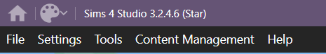
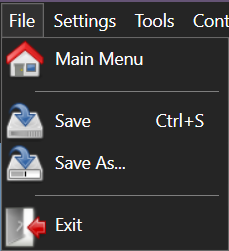
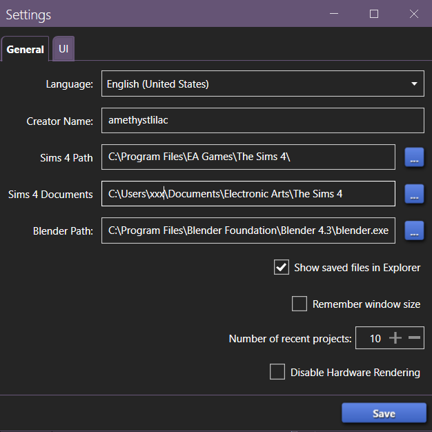
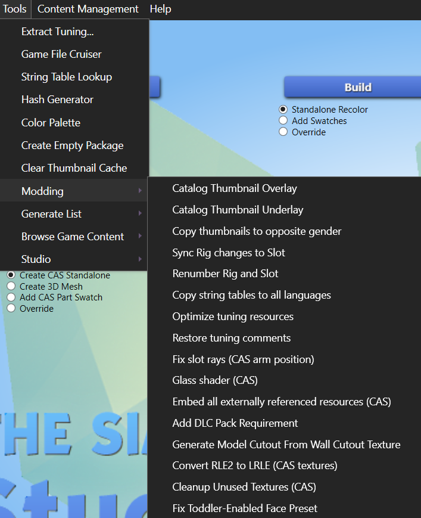
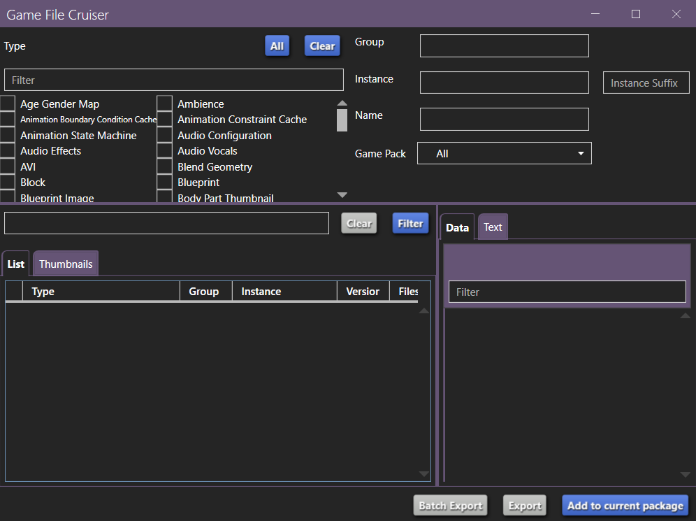
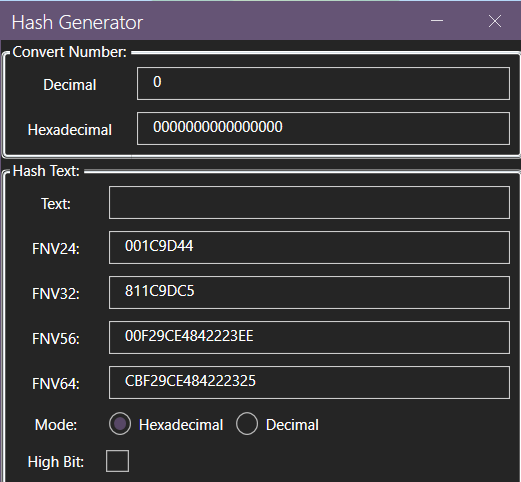

A guide by Amethyst Lilac

This guide will go over the various menus and buttons at the top of [Sims 4 Studio](https://sims4studio.com/board/6/download-sims-studio-open-version), possibly the most commonly used tool in Sims 4 modding and custom content creation.

# The title bar

On the left end of the title bar is a house icon. If you click it at any point, it will take you back to the main page of Sims 4 Studio. It will exit any package you're editing ***without*** saving anything that isn't already saved. Note that some things auto save and some don't, so make sure to back up your files because exiting without saving doesn't always reverse accidental or mistaken changes.

Next to the house is a paint palette. This is a drop-down menu that lets you pick a theme for Sims 4 Studio. There are many colour options, and you can pick light or dark mode, or classic for the original Sims 4 Studio theme.

# The menu bar

## File

The File menu has four options:

1. Main Menu: This will take you back to the main page of Sims 4 Studio. It will exit any package you're editing ***without*** saving anything that isn't already saved. Note that some things auto save and some don't, so make sure to back up your files because exiting without saving doesn't always reverse accidental or mistaken changes.
2. Save: This will save your currently open package file. It also shows the kwyboard shortcut for save-as, which id Ctrl + S. If you don't have a currently open package, this option will be greyed out.
3. Save As...: This will save your currently open package file as a new file, and then will have that new file open. This will ***not*** re-instance your file, meaning that it will conflict with the original file. This can be used as a method of creating a new version of your file to test things in without changing the original, but it cannot be used to create a new file that will co-exist with the original, such as a recolour. Use the buttons below to create files for that. If you don't have a currently open package, this option will be greyed out.
4. Exit: This will exit S4S immediately and without saving.

## Settings

The Settings button in the menu will bring up the Settings window for S4S.

There are two tabs: General and UI. At the bottom is a Save button, which you need to use to save your settings.

The General tab has:

* a drop down menu to select the language S4S will use.
* a box that shows your creator name. You can enter it here or on the main page of S4S.
* a box for your Sims 4 Path. This is your game installation path. On Windows, this would show the folder with your `__Installer`, `Data`, `Delta`, and world files, not where your .exe file is, and not the folder in your Documents folder. You can type/paste it in manually or used the `...` button to the right to navigate to the folder.
* a box for your Sims 4 Documents folder. Typically, this would be located at `C:\Users\USERNAME\Documents\Electronic Arts\The Sims 4`. It's where your Mods folder is. You can type/paste it in manually or used the `...` button to the right to navigate to the folder.
* a box for your Blender path. This should point to the `blender.exe` for the version of Blender that you want S4S to use. Refer to the download page for S4S to see the currently supported versions of Blender. You can type/paste it in manually or used the `...` button to the right to navigate to the folder.
* a check box for Show saved files in Explorer.
* a check box for Remember windoe size: if this is checked, S4S should open with the same window size it had when you last closed it.
* a selection box for Number of recent projects: This setting determines how many files S4S will remember under My Projects on the main page of S4S. You can type in a number or use the plus and minus buttons.
* a check box for Disable Hardware Rendering: This setting can be toggled if you're having issues like jagged edges, weird lines, CC being invisible in studio, or extreme lag. You may need to experiment with it toggled on and off, and it may need to be on in some situations and off in others.

The UI tab has options to toggle on and off various confirmation messages, warnings and alerts.

## Tools

### Extract Tuning...

The first option in the Tools menu is Extract Tuning... If you click it, S4S will begin processing combined tuning, and when that completes, a new window will open.

Below the title bar is an empty search bar. You can use this to find the specific tuning files you're looking for. You may get multiple results with the same name, and there's no way to know which one(s) you want until you extract them -- grab them all, and delete any you end up with that you don't want. Sometimes you may not get all of the ones you select, but you should get the one(s) you need.

You can select one of the files listed or multiple. When you export a file, you will also get any SimData files that are associated with that file (except in rare cases where there are multiple SimData files, but you may not run into that if you're modding for years).

At the bottom, there are four check boxes and two buttons.

*__Use EA Naming__*: It's probably best to leave this off unless you have a reason to want it on. Having it checked means that the file you extract will have all descriptive text removed from the file name. It will give you a file name like `0x00000000!0x00000000000686f5.0xbb0f19d8` instead of a file name using S4S naming: `BB0F19D8!00000000!00000000000686F5.accountReward_DecemberEvent_02.AccountRewardTuning.xml`. It only has an effect if you extract the tuning file instead of adding it to a package file.

*__Use Subfolders__*: Again, this only affects files if you extract them instead of adding them to a package. Having this on will put the extracted files in subfolders based on type. SimData will go in one folder, Account Reward Tuning will go in another, Achievement Tuning will go in another, etc. Except for SimData, this is based on the first part of the file name in the list: achievement/EP_05_PolarBearClub will get one file in a folder called Achievement Tuning, and account_reward/accountReward_DecemberEvent_02 will get one file in a folder called Account Reward Tuning and a second in a folder called SimData. Whether you have this checked is a matter of preference.

*__Extract All__*: This will extract all tuning and SimData files. This is an alternative to using the [XML Extractor](https://thesims4moddersreference.org/tutorials/xml-extractor/) to extract tuning. This will take *a while*.

*__Include Class Names__*: This will toggle including class names in the comments (`<!--posture_StandExclusive--></T>` vs `<!--Posture: posture_StandExclusive--></T>`). It's purely a matter of preference, but if you intend to compare a file from different patch levels, then it would be best to be consistent.

*__Add to current package__*: This will either add the selected tuning and associated SimData to the package that you had open when you opened the Extract Tuning window or offer to create a new package file if you didn't have a package file open. It may take a while, depending on how many files you selected.

*__Export__*: This will export the tuning files and associated SimData to a location of your choosing. It may take a while, depending on how many files you selected. It will open the folder and then extract, so while it may look like it did nothing, you'll need to wait for it to finish.

### Game File Cruiser

If you click this option, a new window will open called Game File Cruiser. You can use this to browse through the game's files.

At the top left is a list of file types with check boxes. Above them is a filter bar. If you type into the filter bar, it will show you only file types that contain your search term. Above that are two buttons, All and Clear. All will select all file types. Clear will clear all check boxes. To see any files, you need to check at least one box.

At the top right are more ways to search. At the top, you can filter by Group. Below that, you can filter by Instance, and to the right of that by Instance Suffix. Next you can type or paste in a Name, and the Instance field will auto fill. Last, you can filter by pack.

At the bottom right is the area where the file you're looking at will display. There are typically two tabs, and what they contain is contextual. It may be Data and Text, or it might be Image and Data.

At the bottom left is where you select a file to look at. Before you can select a file, you need to choose one or more file type at the top, and filter the search here. You can enter something in the search bar to narrow it down, or you can click the Filter button and see everything that matches all other active filters. This is useful if you want to find something without a helpful file name, or if you want to scroll all files of a certain type. If you enter a search term, you can clear it by clicking Clear. 

Once you have your list of files, you can select one by clicking on it, and it will display on the right.

### String Table Lookup

If you click this option, a new window will open called String Table Lookup. You can use this to browse through the game's strings.

At the top, you can enter a search term and then click the Filter button at the right to see only strings that contain your search.

Then you can choose to see strings from all languages or a specific one.

Then the strings are displayed in three columns: language, key, and text.

### Hash Generator

If you click this option, a new window will open called Hash Generator. You can use this to hash various things that you need hashed.

At the top, you can convert between decimal and hexidecimal numbers.

Below, you can enter text and it will be converted to various types of hashes. Under the hashes, you can select the mode. The default is hexidecimal. You can switch to decimal if you need decimal.

At the bottom is a check box to force the hashing to be high bit.

### Color Palette

