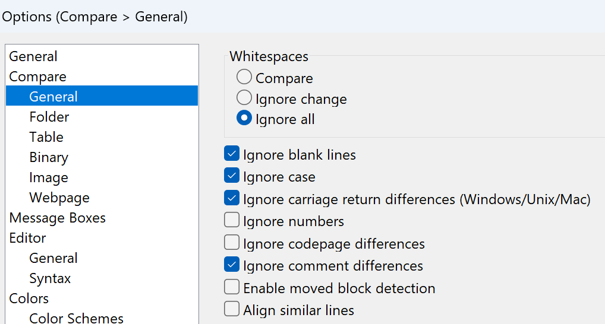
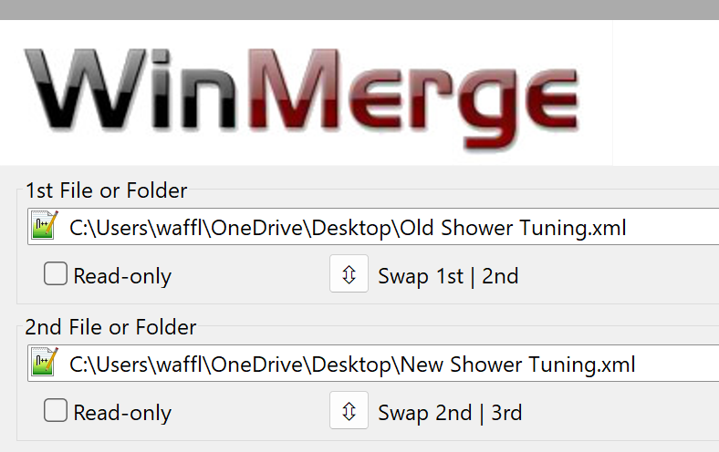
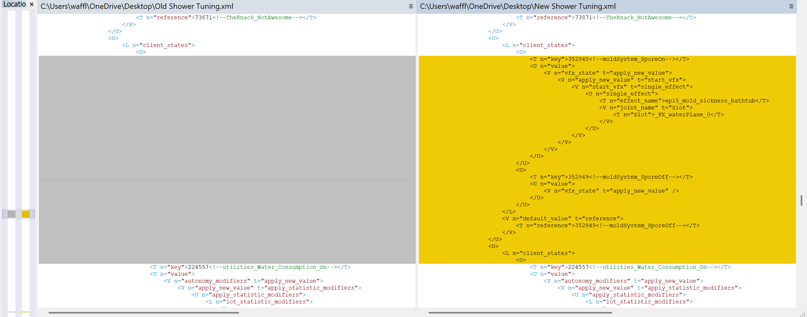
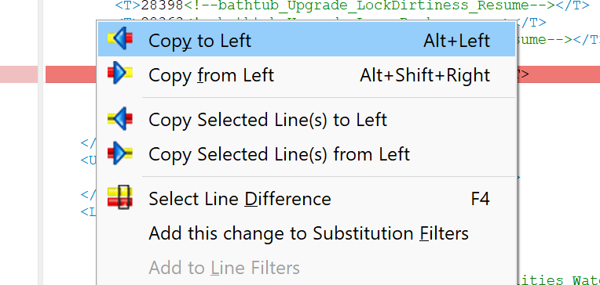

A tutorial by Waffle

So you've got your files extracted with ***[Scumbumbo XML Extractor](xml-file-finder.md).*** A new patch comes out...it's time to extract new files! But then what? Now you've got the old files and the new files...and you've joined **[Creator Musings](https://discord.com/invite/qxz5Kn5)**, where we have a patch thread that tells you exactly which files changed between patches.

 

How do you know the differences?

You use a program like [**WinMerge!**](https://winmerge.org/)

WinMerge can be used to very simply see what's different between two changed files, whether they're EAs, yours, or both. You can use it to update your own mods if they contain XML Overrides, or to see what content changes were made by a patch that you may need to implement into your own files.

Download and install the program, and first things first open up the options under File -> Settings.

My options are all at default aside from making sure the "General" settings under "Compare" match these:

Ignore Comment Differences is important for this process because different extraction methods sometimes give you different comment formatting, so you don't want the files telling you there's a difference just because the comments are different. 

Otherwise, default settings should work just fine for general use! You can also alter these settings with the Wrench button on the main toolbar at any time.

### Using WinMerge to Update a Mod

WinMerge is pretty easy. For the purposes of this guide, [you can download example files here.](https://www.patreon.com/posts/135503375)

 

In this example, we're going to compare an "Older" XML to a "Newer" XML, and pretend to use the information we find to understand how to update a modded object. We've got a modded shower...and it turns out, this patch has updated every single shower object in the game. So it's probably important to update our shower, too. But how do we know what to do? What changed?

First, open WinMerge and click File -> Open, or the open folder icon on the toolbar. You'll get a window asking for your 1st File or Folder and 2nd File or Folder. Click "Browse" and select our two example files.

Now click "Compare". You'll get a window with the first file on the left and second on the right. 

 

> **Quick Tip:** If you click the "New" button on the toolbar of two pieces of paper on top of each other, you can open this window with blank pages. This is what I do when bulk comparing tuning. I'll open the new tuning in the tdesc builder and copy it into one half of the screen, then copy my modded tuning into the other half of the screen, to know what changed and needs updating quickly across lots of files, without having to do extractions or find the actual files.

 

You'll see a big long bar on the left with some yellow marks. The yellow marks represent changes between the two files. In this case, the right file has two new additions. If you click on the bar on the left you can navigate directly to the changes. Click the first big yellow block.

Looks like in the new tuning, there's some new Client States. They reference the Mold System and Spores...must be from the For Rent patch that added a mold system. Showers now have mold states to generate spores, maybe? But there's another change way further down. Click the tiny yellow sliver on the left bar to see what it is. Looks like there's a new affordance added to showers for the mold system, too. Must be for when Sims use the shower while it's moldy, or something? We don't really need to be sure- we just now know that the showers got updated to account for these things. Simple!

Now, let's pretend that instead of old tuning, we've loaded up our own custom shower tuning. It matches the game's main Shower Tub tuning (which is what we've loaded on the right side), so we can just copy the new stuff over to our modded tuning and it'll be good to go!

So let's open our tuning up in the tdesc builder and- wait, no, that's dumb. Just copy the text into your file. So go into the right side of the panel and copy- wait, no, there's a better way!

You can click on any differences in the file, and they'll highlight red. Then right click, and select "Copy Selected Lines To Left". This will automatically add the changes to our file on the left. If you do this for both sets of changes, tada! The old tuning has now been updated to match the new changes, and our imaginary "Custom Shower" now supports the mold system changes made by this patch. Easy!

There are buttons at the top to copy all changes one direction or the other, but you won't want to use these in most cases, especially if you're updating a mod. If your mod has changed anything in the tuning, you won't want EA's tuning to overwrite it and ruin those changes, right? So be sure to hand-check everything that changed so you aren't just undoing your own mod. In that instance, the file on the left would show a yellow difference, not the file on the right, so always check for that instead of blindly copying everything over at once.

 

There are also sometimes EA additions you may not want or need to copy into older tuning. Read the changes carefully!

> **Another quick tip:** Work smarter! You've just loaded up your mod and the new EA patch changes for the same tuning...don't copy all of EA's changes to your mod. Copy your changes to EA's tuning! If you've changed 3 or 4 values in a huge tuning file and EA added a bunch of stuff to it...just copy your changed values into the new XML and replace your modded tuning with that one. The end result is the same, but you skipped a lot of copying over.

There are a lot of advanced features in WinMerge to explore on your own, like putting in filters so certain changes aren't listed, or find-and-replace functions, but generally you'll get through patch day difference checking just fine with what you learned here!

---

Originally written by [Waffle](https://www.patreon.com/c/waffle_mix_ins/) for this site.