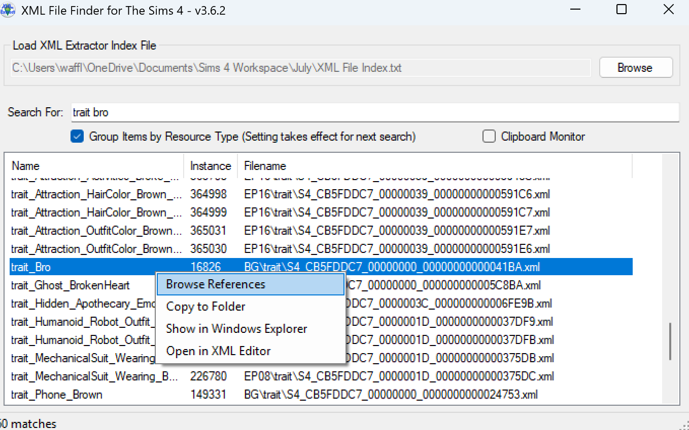
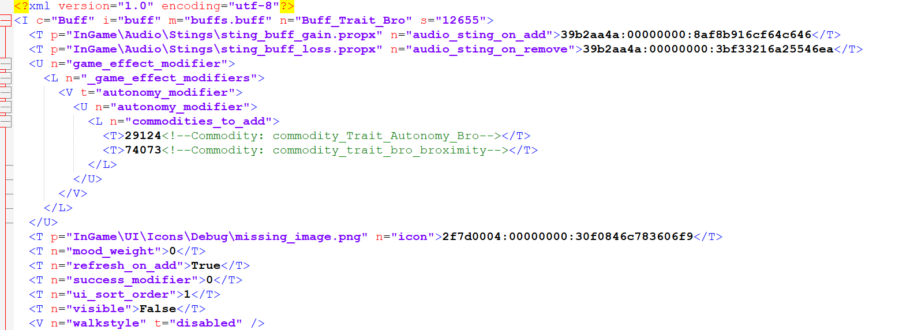
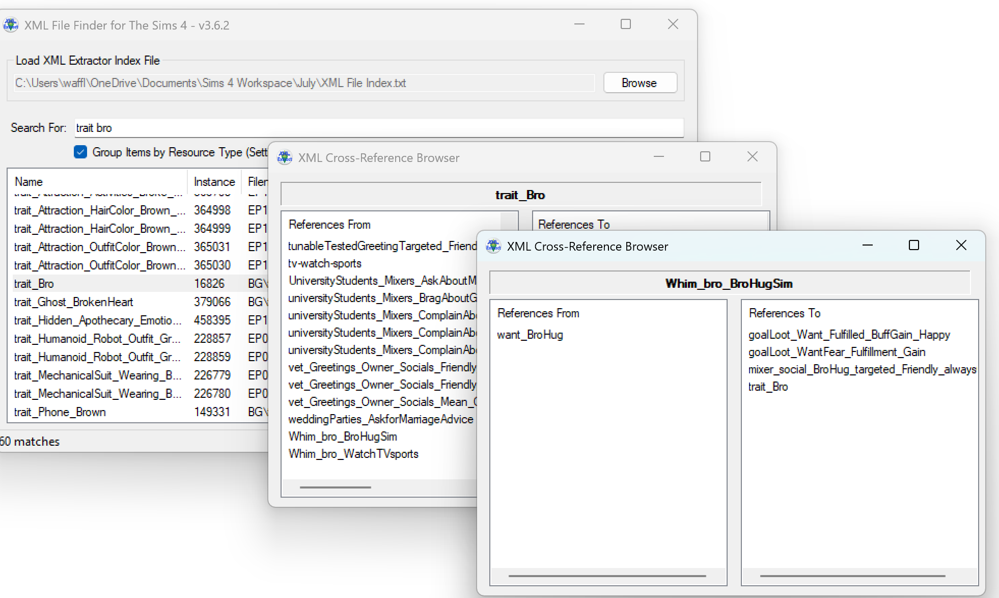

<sup><sub>A tutorial by Waffle</sup></sub>

[Scumbumbo's XML File Finder](https://scumbumbomods.com/xml-extractor/) can be used to navigate through The Sims 4's tuning files by viewing all XML tunings they directly connect to.

If you select the "Bro Trait" for example, you'll see that within the bro trait are references to two buffs, an interaction, another trait, and a whimset. 

But you'll also be able to see every single piece of tuning that references the Bro Trait itself, for a quick and easy way to know "What parts of the game think about the Bro Trait?".

This can be very complicated to parse through, but very powerful for understanding how the game works to make your own mods or change how EA tuning works. 

To use the XML File Finder, you'll need to first use XML Extractor (found in the same download), which you can find a tutorial for ***[here](https://thesims4moddersreference.org/tutorials/xml-extractor/).***

Unfortunately, it's not very useful for finding things inside of tunings that aren't references to other tunings...if you want to find which tunings reference things like tags, icons, or even just lines of tuning, you'll want to use [Lumpinou's Tuning Game Example Finder!](https://app.ts4modhound.com/tools/game_example_search)


Basic Usage
---

Setting up XML File Finder is very simple. After you've followed the XML Extractor tutorial, simply direct the program to the XML Extractor Index file it created. This will be in the folder you extracted your tuning files to. So if you extracted to a folder titled "July 30th" to indicate these tunings were from the July 30th patch, the index file will be in that folder. It is titled "XML File Index.txt".

Tick the option "Group Items by Resource Type". This will sort search results into groups based on what their resource type is- such as Statistic, Trait, Buff, etc.

That's it! You can now search for tunings by Filename, Instance, Pack, Resource Type, and even their TGI Values if you extracted with the "TGI + Name" option during the Extractor tutorial.

Searching does not require operators like "AND" and does not support operators like "OR".

<br>

For instance, fi you want all content from Eco Lifestyle- which is Expansion 9, or EP09, typing "EP09" will show you all files from EP09. Typing "EP09 Buff" will show you all files from EP09 with Buff in the file name. Searching "EP09\\Buff" will search for the filename/folder structure of the files that are in the Buff folder within the EP09 folder, and so on. 

<br>

You can right click the files for the options Browse References, Copy to Folder, Show in Windows Explorer, and Open in XML Editor. Browse References is the main purpose of XML File Finder.

### Browsing References

For the sake of learning the tool, please search for "trait bro".

<br>

This search will give you a lot of results. You'll see actions, aspirations, broadcasters, buffs, etc.

Scroll until you find Trait Bro under "Traits". Be sure "group items by resource type" is selected. If it is not, select it, and search again.

<br>

Right click on "Trait Bro" and select "Browse References".



A window will pop up. At the top is your currently selected tuning. On the left is every tuning file in the game that lists the selected tuning, and on the right is every tuning in the game that is listed *by* the selected tuning.

<br>

From here we can do a lot of sleuthing. Looking at the list on the right, we can see that the Bro Trait itself doesn't handle a lot. Traits are often pretty simple, so that makes sense. But what does it handle, and how does it work?

Since Traits often have Trait Buffs, we can see the Buff\_Trait\_Bro tuning on the right. You can right click this and open it in an XML viewer (usually just a text program you already have installed) and view the tuning. If you do that, you'll see the buff has the following tuning referenced inside:

```
29124<!--Commodity: commodity\_Trait\_Autonomy\_Bro-->

74073<!--Commodity: commodity\_trait\_bro\_broximity-->
```



Instead, click on Buff\_Trait\_Bro. The window will update- you now have Buff\_Trait\_Bro selected and can see everything that references it on the left, and everything it references on the right. You just saw the two commodity tunings it references inside of its XML tuning, right? Now, they're listed in file finder because those were the only two references inside this XML. 


When viewing a particularly complicated XML, this is a very fast way to check everything that it references without having to scroll the entire thing and scan for tuning names and comments!

On the left, we see trait\_bro, which is where we came from. But we also see recipe\_Drink\_ProteinShake. Why is that here?

Right click it and view the XML again. Ctrl-F inside the document and search "buff\_trait\_bro" to find where this buff is referenced inside that tuning. Looks like it's used for a Mood Weight Multiplier. Now we know that when Sims have the Bro Trait, they get the Bro Trait Buff, and that if they have that buff, they'll get a special effect from drinking a Protein Shake. Not sure how that works? Figure it out using the Tdesc Builder!

<br>

If you head back to trait\_bro, you can see on the left side of the screen all sorts of things that refer to it. Scroll through it just to get an idea of how complex this game is, until you reach the bottom and see "Whim\_Bro\_BroHugSim". Right click it and choose "Browse References".

A second reference window will pop up, and the old one will still be usable. You can use this feature when things get messy and confusing to keep track of what tunings you're searching through. 



Let's figure out how a Sim can get this whim. Seems pretty obvious, but you'll see want\_BroHug on the left. Click it. Now we see whimset\_HasTraitBro on he left...so this want comes from that whimset! But where does that whimset come from? Click it!

Surprise! It comes from trait\_bro. Now we know that the only way to get this whimset is from having the bro trait. Stands to reason the only way to use the interaction we just learned solves this whim is to have the bro trait then, right? 

Click on trait\_bro again, and we're back where we started. You can see how this gets complicated and confusing- but also how it can teach you not only how the game works, but how to copy those things to add your own new content, and to find what sort of tuning contingencies you may need to be aware of when editing things. 

<br>

Maybe you see trait\_Grouch on the right side and wonder "How do Grouches have anything to do with Bros...?". Well, now you know what tuning to look at to see why it's over there, and if you click on it...you can start to learn what the Grouch trait does and how it works, too. [Don't worry, I already did the work on that one](https://www.patreon.com/posts/117230327)- and if you read that post, you'll get an idea of how powerful XML File Finder is, because all the information on that post came from doing all the steps you just tried above!

<br>

The XML File Finder is critical to our understanding of how the game's content actually works. It's easy to navigate down through files- since we can open them and see what they reference. But doing it in reverse like we did here is next to impossible without a tool like this. It's very powerful, and a must-have modder resource!

---

Originally written by [Waffle](https://www.patreon.com/c/waffle_mix_ins/) for this site.